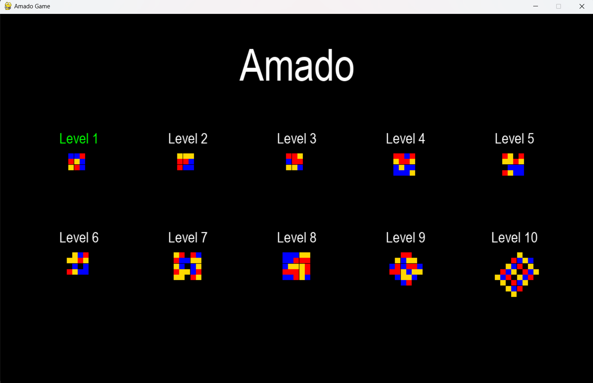
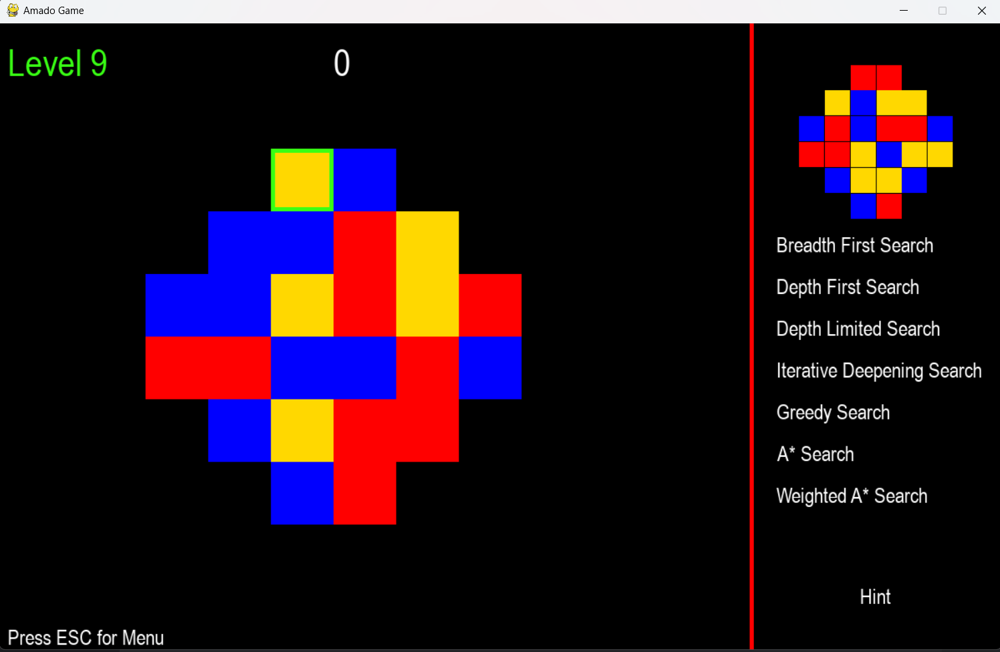
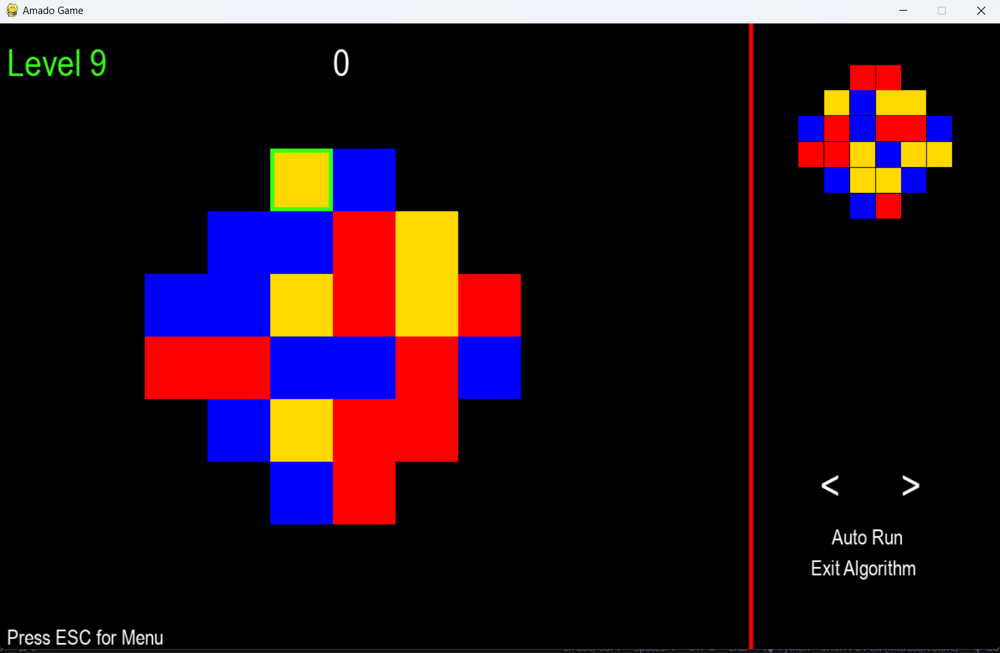
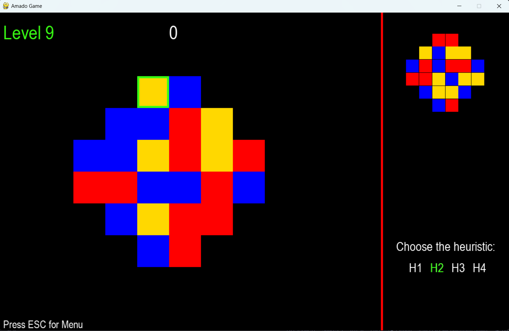
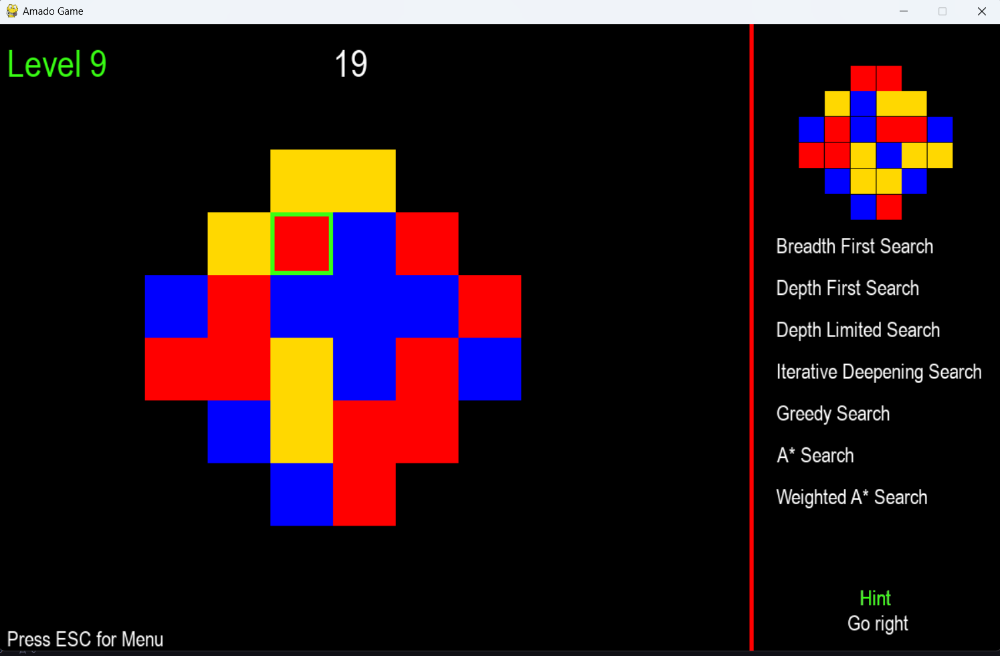
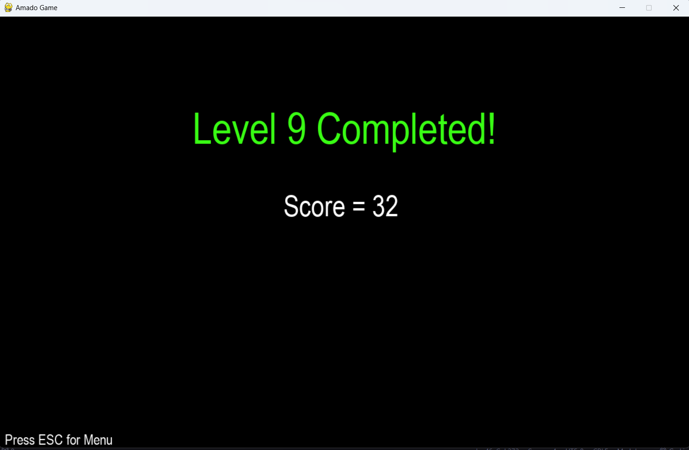

# Jogo Amado

## Elementos do grupo

**Group A1_42**

António Marujo Rama 202108801

Matilde Isabel da Silva Simões 202108782

Manuel Ramos Leite Carvalho Neto 202108744

## Configurações

Para iniciar o jogo é necessário correr no terminal o seguinte comando

```bash
python main.py
```

Para ter acesso a análise dos algoritmos é necessário instalar a biblioteca de python *memory_profiler* e correr o comando

```bash
pip install memory_profiler
python analysis.py
```

## Como usar o programa

O jogo começa com um menu onde o joagdor pode escolher qual é o nível de dificuldade que pretende jogar. Existem 10 níveis de dificuldade, sendo que o nível 1 é o mais fácil e o nível 10 é o mais difícil. Para selecionar o nível usa-se as setas do teclado e para confirmar a seleção usa-se a tecla Enter.



Após a seleção do nível, o jogador é redirecionado para a página do jogo, onde encontra o tabuleiro inicial à esquerda, o qual deve corresponder ao tabuleiro final exibido à direita. Para trocar as cores dos quadrados, o jogador utiliza as setas do teclado, sendo o quadrado com bordas verdes, o atual selecionado. No lado esquerdo, também é observado o número de movimentos realizados até o momento, e é possível sair do nível pressionando a tecla *ESC*. À direita, juntamente com os algoritmos disponíveis para o jogador selecionar, existe a opção de solicitar dicas sobre como resolver o jogo, tudo acessível através do rato.



Ao escolher um algoritmo para resolver o nível, o jogador pode interagir com o jogo enquanto o algoritmo está a ser executado. Pode, assim, utilizar as setas representadas no ecrã para realizar o movimento anterior ou o seguinte, clicar o *Auto Run* para visualizar a resolução do nível automaticamente, ou clicar em *Exit Algorithm* para parar a execução do algoritmo.



Ao selecionar em algoritmos onde se limita a profundidade, é pedido ao jogador para inserir a profundidade máxima que deseja. Se for selecionado um algoritmo onde se utiliza heurísticas, é pedido ao jogador para escolher a heurística que deseja utilizar.




Ao selecionar a opção de dicas, é fornecida a melhor jogada a realizar.



Quando o jogador termina o nível, é redirecionado para a página de conclusão do nível, onde é possível visualizar o número de movimentos realizados representado pelo *Score*. Para voltar ao menu principal, o jogador deve pressionar a tecla *ESC* e escolher um novo nível.

